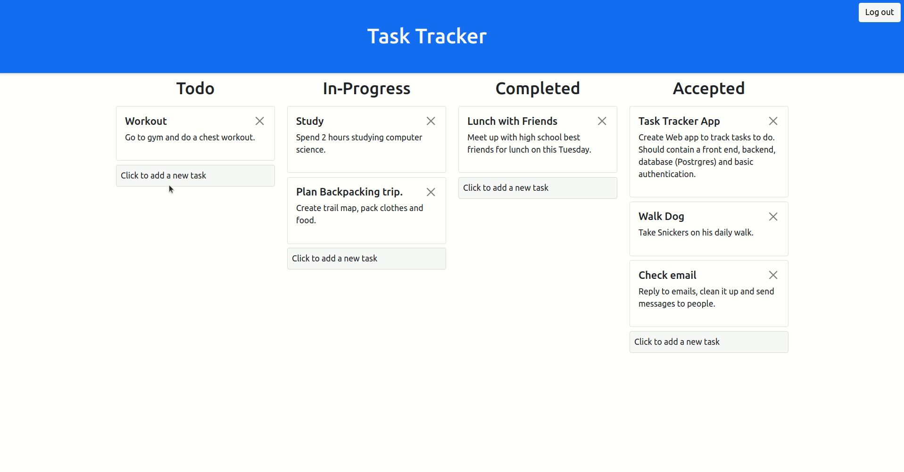
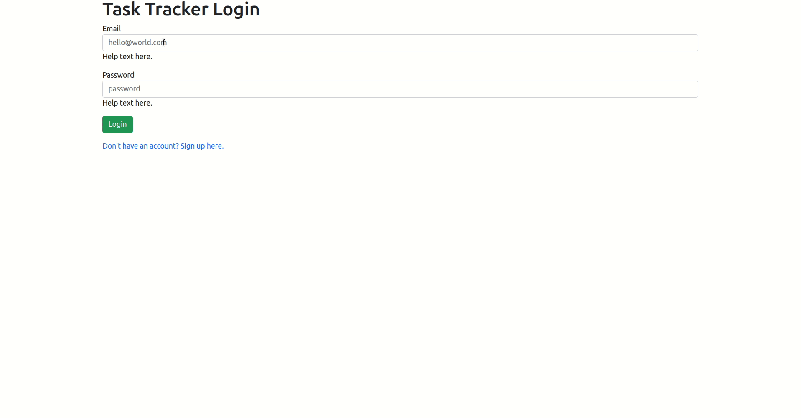
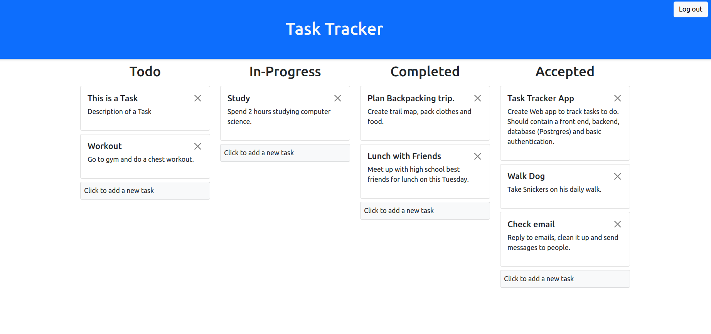

# Task Tracker
## Demo

## Basic Authentication and Authorization.

## Additional Photo(s)

## Requirements
- Nodejs
- Express
- Postgresql
- nodemon
- http-server

## Setting up Postgresql
https://blog.logrocket.com/nodejs-expressjs-postgresql-crud-rest-api-example/

Follow the instruction in the above link to:
- Download postgresql
- Create database (Name it "task_tracker_db")
- Create role 

### Connecting to postgres with the role "me".
> psql -d postgres -U me

- enter password

> \c task_tracker_db

### Tables 
You need to create 2 Tables (tasks and users) with the following schema:

                                     Table "public.tasks"

 Column  |          Type           | Collation | Nullable |              Default           

---------+-------------------------+-----------+----------+-----------------------------------

 id      | integer                 |           | not null | nextval('tasks_id_seq'::regclass)

 status  | character varying(30)   |           |          | 

 title   | character varying(100)  |           |          | 

 text    | character varying(500)  |           |          | 

 user_id | character varying(1000) |           |          | 

                                           Table "public.users"

  Column   |            Type             | Collation | Nullable |                Default      

-----------+-----------------------------+-----------+----------+----------------------------------------

 user_id   | integer                     |           | not null | nextval('users_user_id_seq'::regclass)

 email     | character varying(255)      |           | not null | 

 password  | character varying(200)      |           | not null | 

 date      | timestamp without time zone |           | not null | 

 is_active | boolean                     |           |          | true

Indexes:
    "users_pkey" PRIMARY KEY, btree (user_id)
    "users_email_key" UNIQUE CONSTRAINT, btree (email)

## Setting up backend server.
> cd server

> npm install

# Getting Started
1. Make sure you download all dependencies and set up postgresql as described
above.

2. Create .env file with the following information filled out:

    DB_HOST=

    DB_USER=

    DB_NAME=

    DB_PASS=

    DB_PORT=

    COOKIE_SECRET=

3. Make sure node js app (shared.js and other files), and website server have correct
root address. In this example - 'localhost'.

4. Launch backend server
> cd server

> nodemon index.js

5. Launch website on local host
> http-server -a localhost

6. Go to browser and enter localhost:8080.

7. Login or signup. You are now ready to use the app!

# Additional Notes
### .gitignore
Ignored .env because it contains sensitive information for DB.

#### cross origin cookies
Make sure root address is the same for node js app and website server. Example:
'localhost'.
